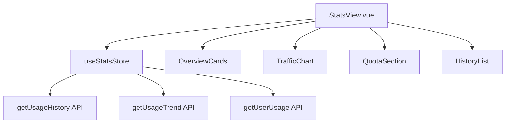

# Design Document: ToVPN 项目优化

## Overview

本设计文档描述 ToVPN 项目的优化方案，包括：
1. 新增 API 接口函数实现
2. StatsView 页面真实数据对接
3. 类型定义完善
4. 错误处理优化

技术栈：Vue 3 + TypeScript + Pinia + Tauri v2 + Rust

## Architecture

### 现有架构

```
src/
├── api/           # API 请求模块
│   ├── auth.ts    # 认证相关 API
│   ├── server.ts  # 服务器节点 API
│   ├── user.ts    # 用户相关 API
│   └── index.ts   # 统一导出
├── stores/        # Pinia 状态管理
├── types/         # TypeScript 类型定义
├── views/         # 页面组件
└── utils/         # 工具函数
```

### 优化后架构

```
src/
├── api/
│   ├── auth.ts      # 认证 API（已完成）
│   ├── server.ts    # 服务器 API（已完成）
│   ├── user.ts      # 用户 API（扩展）
│   ├── stats.ts     # 新增：统计 API
│   ├── plan.ts      # 新增：套餐/订阅 API
│   ├── device.ts    # 新增：设备管理 API
│   ├── announce.ts  # 新增：公告 API
│   ├── invite.ts    # 新增：邀请 API
│   └── index.ts     # 统一导出
├── types/
│   ├── api.ts       # API 通用类型
│   ├── login.ts     # 登录相关类型
│   ├── server.ts    # 服务器类型
│   ├── user.ts      # 用户类型（完善）
│   ├── stats.ts     # 新增：统计类型
│   ├── plan.ts      # 新增：套餐类型
│   ├── device.ts    # 新增：设备类型
│   └── index.ts     # 统一导出
└── stores/
    └── stats.ts     # 新增：统计状态管理
```

## Components and Interfaces

### 1. 新增 API 模块

#### 1.1 stats.ts - 统计 API

```typescript
// src/api/stats.ts

/** 获取历史使用统计 */
export function getUsageHistory(params: UsageHistoryParams): Promise<UsageHistoryResponse>

/** 获取流量趋势数据 */
export function getUsageTrend(params: UsageTrendParams): Promise<UsageTrendResponse>
```

#### 1.2 plan.ts - 套餐 API

```typescript
// src/api/plan.ts

/** 获取套餐列表 */
export function getPlans(): Promise<Plan[]>

/** 获取当前订阅 */
export function getSubscription(): Promise<Subscription>

/** 创建订单 */
export function createOrder(data: CreateOrderData): Promise<OrderResult>

/** 查询订单状态 */
export function getOrderStatus(orderId: string): Promise<OrderStatus>
```

#### 1.3 device.ts - 设备管理 API

```typescript
// src/api/device.ts

/** 获取设备列表 */
export function getDevices(): Promise<Device[]>

/** 移除设备 */
export function removeDevice(deviceId: string): Promise<void>
```

#### 1.4 announce.ts - 公告 API

```typescript
// src/api/announce.ts

/** 获取公告列表 */
export function getAnnouncements(params: PaginationParams): Promise<AnnouncementListResponse>
```

#### 1.5 invite.ts - 邀请 API

```typescript
// src/api/invite.ts

/** 获取邀请码 */
export function getInviteCode(): Promise<InviteCodeInfo>

/** 获取邀请记录 */
export function getInviteRecords(params: PaginationParams): Promise<InviteRecordListResponse>
```

### 2. StatsView 组件重构



### 3. 状态管理 - stats.ts Store

```typescript
// src/stores/stats.ts
export const useStatsStore = defineStore('stats', () => {
  // State
  const todayStats: Ref<UsageStats | null>
  const historyRecords: Ref<UsageHistoryItem[]>
  const trendData: Ref<UsageTrendData | null>
  const isLoading: Ref<boolean>
  const error: Ref<string | null>
  
  // Actions
  async function loadTodayStats(): Promise<void>
  async function loadHistory(params: UsageHistoryParams): Promise<void>
  async function loadTrend(params: UsageTrendParams): Promise<void>
})
```

## Data Models

### 统计相关类型

```typescript
// src/types/stats.ts

/** 历史使用统计查询参数 */
export interface UsageHistoryParams {
  period?: 'today' | 'week' | 'month'
  page?: number
  page_size?: number
}

/** 历史使用统计项 */
export interface UsageHistoryItem {
  date: string
  download: number      // 下载流量（字节）
  upload: number        // 上传流量（字节）
  duration: number      // 连接时长（秒）
  connections: number   // 连接次数
}

/** 历史使用统计响应 */
export interface UsageHistoryResponse {
  list: UsageHistoryItem[]
  total: number
  page: number
  page_size: number
  summary: {
    total_download: number
    total_upload: number
    total_duration: number
    total_connections: number
  }
}

/** 流量趋势查询参数 */
export interface UsageTrendParams {
  period?: 'week' | 'month' | 'year'
  granularity?: 'hour' | 'day' | 'week'
}

/** 流量趋势数据 */
export interface UsageTrendData {
  labels: string[]
  download: number[]
  upload: number[]
  duration: number[]
}
```

### 套餐相关类型

```typescript
// src/types/plan.ts

/** 套餐信息 */
export interface Plan {
  id: number
  name: string
  price: number
  duration: number        // 天数
  traffic_limit: number   // 流量限制（字节），-1 表示无限
  time_limit: number      // 时长限制（秒），-1 表示无限
  features: string[]
  recommended: boolean
}

/** 订阅信息 */
export interface Subscription {
  plan_id: number
  plan_name: string
  start_date: string
  expire_date: string
  auto_renew: boolean
  status: number          // 1=有效 2=已过期 3=已取消
}

/** 创建订单参数 */
export interface CreateOrderData {
  plan_id: number
  payment_method: 'alipay' | 'wechat'
  coupon_code?: string
}

/** 订单结果 */
export interface OrderResult {
  order_id: string
  amount: number
  original_amount: number
  discount: number
  payment_url: string
  expire_time: string
}

/** 订单状态 */
export interface OrderStatus {
  order_id: string
  status: number          // 0待支付 1已支付 2已取消 3已过期 4已退款
  status_text: string
  amount: number
  paid_at?: string
}
```

### 设备相关类型

```typescript
// src/types/device.ts

/** 设备信息 */
export interface Device {
  id: number
  device_id: string
  device_name: string
  device_type: 'desktop' | 'mobile' | 'tablet'
  os: string
  last_active: string
  is_current: boolean
}
```

### 公告相关类型

```typescript
// src/types/announce.ts

/** 公告信息 */
export interface Announcement {
  id: number
  title: string
  content: string
  type: 'notice' | 'update' | 'maintenance'
  priority: number
  created_at: string
}

/** 公告列表响应 */
export interface AnnouncementListResponse {
  list: Announcement[]
  total: number
  page: number
  page_size: number
}
```

### 邀请相关类型

```typescript
// src/types/invite.ts

/** 邀请码信息 */
export interface InviteCodeInfo {
  invite_code: string
  invite_url: string
  total_invited: number
  total_reward: number
}

/** 邀请记录 */
export interface InviteRecord {
  id: number
  invited_user: string    // 脱敏后的用户标识
  reward: number
  status: number          // 1=有效 2=待确认
  created_at: string
}

/** 邀请记录列表响应 */
export interface InviteRecordListResponse {
  list: InviteRecord[]
  total: number
  page: number
  page_size: number
}
```

## Correctness Properties

*A property is a characteristic or behavior that should hold true across all valid executions of a system-essentially, a formal statement about what the system should do. Properties serve as the bridge between human-readable specifications and machine-verifiable correctness guarantees.*

### Property 1: TypeScript 类型完整性

*For any* API 函数，其请求参数和响应数据都应有对应的 TypeScript 接口定义，且 TypeScript 编译器不应报告类型错误。

**Validates: Requirements 1.2, 6.1, 6.4**

### Property 2: 使用统计数据正确显示

*For any* 从 API 返回的使用统计数据（UsageStats），StatsView 页面应正确显示下载量、上传量、时长和连接次数，且数值格式化后与原始数据一致。

**Validates: Requirements 3.1**

### Property 3: 时间周期筛选触发正确 API 调用

*For any* 用户选择的时间周期（today/week/month），系统应调用对应的 API 并传递正确的 period 参数。

**Validates: Requirements 3.4**

### Property 4: API 错误码映射

*For any* 后端返回的错误码，系统应将其映射为用户友好的错误消息，且不应显示原始技术错误信息。

**Validates: Requirements 5.1**

### Property 5: 订阅信息正确显示

*For any* 用户订阅数据（Subscription），ProfileView 页面应正确显示套餐名称、到期日期和状态，且日期格式化正确。

**Validates: Requirements 4.2**

### Property 6: 配额信息与套餐一致

*For any* 用户的套餐限制（traffic_limit, time_limit），ProfileView 和 StatsView 页面显示的配额上限应与套餐定义一致。

**Validates: Requirements 4.3**

### Property 7: API 错误时显示错误状态

*For any* API 请求失败的情况，页面应显示错误提示而非空白或崩溃，且应提供重试选项。

**Validates: Requirements 3.5**

## Error Handling

### 错误码映射表

```typescript
// src/utils/error.ts

export const ERROR_MESSAGES: Record<number, string> = {
  // 通用错误
  0: '操作成功',
  1: '未知错误，请稍后重试',
  2: '参数无效',
  3: '资源不存在',
  
  // 用户相关 (10xxx)
  10001: '用户不存在',
  10002: '用户已存在',
  10003: '账号已被禁用',
  10004: '密码错误',
  10008: '验证码错误',
  10009: '验证码已过期',
  10010: '验证码发送过于频繁',
  
  // 认证相关 (20xxx)
  20001: '请先登录',
  20002: '登录已失效',
  20003: '登录已过期',
  20005: '刷新令牌无效',
  20006: '权限不足',
  
  // 订单相关 (30xxx)
  30001: '订单不存在',
  30002: '订单已支付',
  30003: '订单已取消',
  30004: '订单已过期',
  30005: '支付失败',
  
  // 授权相关 (40xxx)
  40003: '授权已过期',
  40005: '设备数量已达上限',
  40006: '设备不存在',
}

export function getErrorMessage(code: number): string {
  return ERROR_MESSAGES[code] || `错误 (${code})`
}
```

### API 请求错误处理模式

```typescript
// 统一错误处理
try {
  const data = await apiFunction()
  // 处理成功
} catch (e) {
  if (e instanceof Error) {
    // 显示用户友好的错误消息
    notification.error(e.message)
  }
  // 设置错误状态
  error.value = e instanceof Error ? e.message : '请求失败'
}
```

## Testing Strategy

### 测试框架

- **单元测试**: Vitest
- **属性测试**: fast-check (需要安装)

### 单元测试

1. **API 函数测试**
   - 验证请求参数正确传递
   - 验证响应数据正确解析
   - 验证错误处理正确

2. **Store 测试**
   - 验证状态更新正确
   - 验证 action 调用正确的 API

3. **组件测试**
   - 验证数据正确渲染
   - 验证用户交互正确触发 action

### 属性测试

使用 fast-check 库进行属性测试：

```typescript
import fc from 'fast-check'

// Property 2: 使用统计数据正确显示
test('usage stats display matches API data', () => {
  fc.assert(
    fc.property(
      fc.record({
        traffic_used: fc.nat(),
        traffic_limit: fc.nat(),
        time_used: fc.nat(),
        time_limit: fc.nat(),
        connections: fc.nat(),
      }),
      (stats) => {
        const formatted = formatUsageStats(stats)
        // 验证格式化后的数据与原始数据一致
        return parseFormattedBytes(formatted.trafficUsed) === stats.traffic_used
      }
    )
  )
})
```

### 测试覆盖目标

- API 函数: 100% 覆盖
- Store actions: 100% 覆盖
- 关键组件: 80% 覆盖
- 属性测试: 覆盖所有 Correctness Properties

