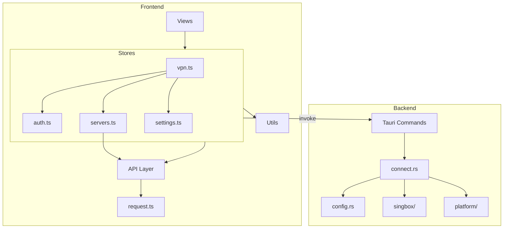

# Design Document: ToVPN 测试用例补全

## Overview

本设计文档描述了 ToVPN 桌面客户端测试用例补全的技术方案。基于现有的项目架构和已有的属性测试基础，补全关键业务逻辑的测试覆盖。

### 项目架构概览

```
ToVPN
├── 前端 (Vue 3 + TypeScript + Pinia)
│   ├── src/api/          # API 接口层
│   ├── src/stores/       # 状态管理 (Pinia)
│   ├── src/utils/        # 工具函数
│   ├── src/types/        # 类型定义
│   └── src/__tests__/    # 测试文件
│
└── 后端 (Rust + Tauri)
    └── src-tauri/src/
        ├── vpn/          # VPN 核心逻辑
        │   ├── connect.rs    # 连接管理
        │   ├── config.rs     # 配置验证
        │   └── singbox/      # sing-box 配置生成
        └── helper/       # 系统扩展管理
```

### 模块调用关系



## Architecture

### 测试架构

```
src/__tests__/
├── api/                    # API 集成测试
│   └── api-integration.test.ts
├── components/             # 组件属性测试
│   └── purchase-modal.property.test.ts
├── stores/                 # Store 属性测试
│   └── vpn-limits.property.test.ts
├── utils/                  # 工具函数测试
│   ├── cache.test.ts
│   ├── debounce.test.ts
│   ├── format.property.test.ts      # 新增
│   ├── validation.property.test.ts  # 新增
│   └── error.property.test.ts       # 新增
└── views/                  # 视图逻辑测试
    └── connection-flow.property.test.ts
```

### 测试策略

1. **属性测试 (Property-Based Testing)**: 使用 fast-check 库验证核心业务逻辑的通用属性
2. **单元测试**: 验证特定边界情况和错误处理
3. **集成测试**: 验证 API 接口格式和响应结构

## Components and Interfaces

### 待测试的核心组件

#### 1. 服务器节点验证 (servers.ts)

```typescript
interface ServerNode {
  id: number;
  domain: string;
  port: number;
  password: string;
  country: string;
  city: string;
  flag: string;
  status: number;
}

// 验证函数接口
function isValidServerNode(node: Partial<ServerNode>): boolean;
function mapStatus(status: number): ServerStatus;
```

#### 2. 缓存管理 (cache.ts)

```typescript
interface CacheItem<T> {
  value: T;
  expireAt: number;
}

interface Cache {
  get<T>(key: string): T | null;
  set<T>(key: string, value: T, ttl: number): void;
  delete(key: string): void;
  clear(): void;
}
```

#### 3. 请求锁 (debounce.ts)

```typescript
interface RequestLock {
  isLocked(key: string): boolean;
  withLock<T>(key: string, fn: () => Promise<T>): Promise<T>;
}
```

#### 4. 数据格式化 (format.ts)

```typescript
function formatBytes(bytes: number): string;
function formatDuration(seconds: number): string;
function formatSpeed(bytesPerSecond: number): string;
```

#### 5. 输入验证 (validation.ts)

```typescript
function isValidEmail(email: string): boolean;
function isValidPassword(password: string): boolean;
function isValidUsername(username: string): boolean;
```

#### 6. 错误处理 (error.ts)

```typescript
interface AppError {
  code: number;
  message: string;
  details?: unknown;
}

function createError(code: number, message: string): AppError;
function getErrorMessage(error: unknown): string;
```

## Data Models

### 测试数据生成器

```typescript
// 服务器节点生成器
const serverNodeArb = fc.record({
  id: fc.integer({ min: 1, max: 10000 }),
  domain: fc.oneof(
    fc.webUrl().map(url => new URL(url).hostname),
    fc.constant(''),
    fc.constant(null as unknown as string)
  ),
  port: fc.integer({ min: 0, max: 70000 }),
  password: fc.string({ minLength: 0, maxLength: 256 }),
  country: fc.stringOf(fc.constantFrom('US', 'JP', 'HK', 'SG', 'KR')),
  city: fc.string({ minLength: 1, maxLength: 50 }),
  flag: fc.constantFrom('🇺🇸', '🇯🇵', '🇭🇰', '🇸🇬', '🇰🇷'),
  status: fc.integer({ min: 0, max: 5 })
});

// 用量数据生成器
const usageArb = fc.record({
  traffic: fc.integer({ min: 0, max: 10 * 1024 * 1024 * 1024 }),
  time: fc.integer({ min: 0, max: 24 * 60 * 60 })
});
```

## Correctness Properties

*A property is a characteristic or behavior that should hold true across all valid executions of a system-essentially, a formal statement about what the system should do. Properties serve as the bridge between human-readable specifications and machine-verifiable correctness guarantees.*

### Property 1: 服务器节点验证完整性

*For any* 服务器节点数据，如果所有必填字段（id > 0, domain 非空, port 在 1-65535 范围内, password 非空）都有效，则验证函数应返回 true；否则返回 false。

**Validates: Requirements 1.1, 1.2, 1.3**

### Property 2: 状态映射双向一致性

*For any* 有效的后端状态值（1, 2, 3），映射到前端状态后，应该能够正确表示节点的可用性（1→online 可连接, 2→maintenance 维护中, 3→offline 不可用）。

**Validates: Requirements 1.4**

### Property 3: 模式切换状态机正确性

*For any* 连接模式切换操作，如果当前已连接，则必须先经过 disconnecting 状态，再进入 connecting 状态，最后到达 connected 状态。

**Validates: Requirements 2.1, 2.2**

### Property 4: 设置持久化往返一致性

*For any* 连接模式设置值（'tun' 或 'socks'），保存后再读取应该得到相同的值。

**Validates: Requirements 2.4**

### Property 5: 分流配置包含必要规则

*For any* TUN 模式配置生成，输出的配置 JSON 必须包含 geosite-cn 和 geoip-cn 规则集引用，以及 .cn/.lan/.local 域名后缀的直连规则。

**Validates: Requirements 3.1, 3.5**

### Property 6: Token 过期检测正确性

*For any* Token 过期时间和当前时间，如果距离过期时间小于 5 分钟，isTokenExpiringSoon 应返回 true。

**Validates: Requirements 4.1**

### Property 7: 登出状态清除完整性

*For any* 登出操作，执行后所有认证相关状态（accessToken, refreshToken, currentUser）都应该被清除。

**Validates: Requirements 4.5**

### Property 8: 缓存 TTL 行为正确性

*For any* 缓存项，设置后在 TTL 时间内应该能够获取到值，TTL 过期后应该返回 null。

**Validates: Requirements 5.1, 5.2**

### Property 9: 缓存更新重置 TTL

*For any* 已存在的缓存项，更新后应该重置过期时间，使其从更新时刻开始计算新的 TTL。

**Validates: Requirements 5.4**

### Property 10: 请求锁互斥性

*For any* 请求锁，当锁被持有时，isLocked 应返回 true；释放后应返回 false。

**Validates: Requirements 6.1, 6.2**

### Property 11: 防抖函数只执行最后一次

*For any* 连续的防抖函数调用序列，在等待期结束后只应执行最后一次调用。

**Validates: Requirements 6.3**

### Property 12: 字节格式化单位选择正确性

*For any* 非负字节数，格式化结果应该选择最合适的单位（B < 1KB, KB < 1MB, MB < 1GB, GB >= 1GB），且数值部分应该在合理范围内（通常 < 1024）。

**Validates: Requirements 7.1**

### Property 13: 时间格式化格式正确性

*For any* 非负秒数，格式化结果应该符合 HH:MM:SS 格式，且各部分数值正确（小时无上限，分钟和秒在 0-59 范围内）。

**Validates: Requirements 7.2**

### Property 14: 速度格式化正确性

*For any* 非负字节/秒速度值，格式化结果应该包含数值和单位（B/s, KB/s, MB/s, GB/s）。

**Validates: Requirements 7.3**

### Property 15: 错误对象结构完整性

*For any* 创建的错误对象，必须包含 code（数字）和 message（字符串）字段。

**Validates: Requirements 8.1**

### Property 16: 错误消息提取健壮性

*For any* 输入（包括 Error 对象、字符串、null、undefined），getErrorMessage 应该返回一个非空字符串。

**Validates: Requirements 8.2, 8.4**

### Property 17: 邮箱验证正确性

*For any* 字符串，如果包含 @ 符号且 @ 前后都有非空内容，且 @ 后包含 . 符号，则应该被认为是有效邮箱格式。

**Validates: Requirements 9.1**

### Property 18: 密码长度验证正确性

*For any* 字符串，长度在 6-32 之间（包含边界）应该通过验证，否则应该失败。

**Validates: Requirements 9.2**

### Property 19: 用户名验证正确性

*For any* 字符串，如果长度在 3-50 之间且只包含字母和数字，应该通过验证。

**Validates: Requirements 9.3**

### Property 20: 状态同步纠正逻辑

*For any* 前端状态和后端状态不一致的情况，同步后前端状态应该等于后端状态。

**Validates: Requirements 10.2, 10.4**

## Error Handling

### 测试中的错误处理策略

1. **边界值测试**: 对于数值输入，测试 0、负数、最大值等边界情况
2. **空值测试**: 对于字符串和对象输入，测试 null、undefined、空字符串
3. **类型错误测试**: 测试错误类型输入的处理
4. **异常捕获测试**: 验证异常被正确捕获和转换

## Testing Strategy

### 属性测试框架

- **库**: fast-check v4.4.0
- **运行次数**: 每个属性测试运行 100 次迭代
- **超时**: 10 秒

### 测试文件命名规范

- 属性测试: `*.property.test.ts`
- 单元测试: `*.test.ts`
- 集成测试: `*.integration.test.ts`

### 测试注释规范

每个属性测试必须包含以下注释：

```typescript
/**
 * **Feature: test-completion, Property {number}: {property_name}**
 * **Validates: Requirements {X.Y}**
 */
```

### 双重测试策略

1. **属性测试**: 验证通用属性，使用随机生成的输入
2. **单元测试**: 验证特定边界情况和已知的边缘案例

### 测试覆盖目标

| 模块 | 属性测试 | 单元测试 |
|------|---------|---------|
| utils/cache.ts | ✓ | ✓ |
| utils/debounce.ts | ✓ | ✓ |
| utils/format.ts | ✓ | ✓ |
| utils/validation.ts | ✓ | ✓ |
| utils/error.ts | ✓ | ✓ |
| stores/servers.ts | ✓ | - |
| stores/auth.ts | ✓ | - |
| stores/vpn.ts | ✓ (已有) | - |
