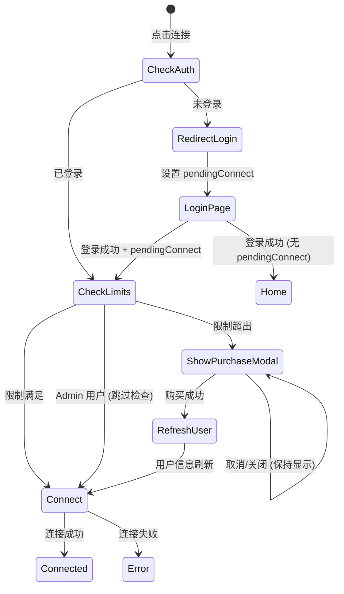

# Design Document: VPN Connection Flow Optimization

## Overview

本设计文档描述了 ToVPN 客户端 VPN 连接流程的优化方案，包括：
1. 未登录连接自动跳转登录后重连
2. 连接前检查用户限制并显示购买弹框
3. 购买成功后自动重连
4. TUN 模式授权问题排查与修复

## Architecture

### 连接流程状态机




## Components and Interfaces

### 1. PurchaseModal 组件 (新增)

```typescript
// src/components/PurchaseModal.vue
interface Props {
  visible: boolean
  onSuccess: () => void
  onCancel: () => void
}

// 功能：
// - 显示套餐列表和价格
// - 处理支付流程
// - 购买成功后触发 onSuccess 回调
// - 点击外部或取消不关闭弹框
```

### 2. VPN Store 扩展

```typescript
// src/stores/vpn.ts 扩展
interface VpnStore {
  // 新增状态
  showPurchaseModal: Ref<boolean>
  pendingConnectAfterPurchase: Ref<boolean>
  
  // 新增方法
  checkUsageLimitsBeforeConnect(): Promise<{ canConnect: boolean; reason?: string }>
  handlePurchaseSuccess(): Promise<void>
  connectWithLimitCheck(): Promise<void>
}
```

### 3. Auth Store 扩展

```typescript
// src/stores/auth.ts 扩展
interface AuthStore {
  // 已有
  pendingAutoConnect: Ref<boolean>
  
  // 新增方法
  refreshUserInfo(): Promise<void>
  setPendingConnect(value: boolean): void
}
```

### 4. Router 扩展

```typescript
// 登录页 query 参数
interface LoginQuery {
  redirect?: string
  pendingConnect?: 'true'  // 新增：标记需要自动连接
}
```

## Data Models

### 用户限制检查结果

```typescript
interface UsageLimitCheckResult {
  canConnect: boolean
  trafficExceeded: boolean
  timeExceeded: boolean
  remainingTraffic: number  // bytes
  remainingTime: number     // seconds
  reason?: string
}
```

### 购买状态

```typescript
interface PurchaseState {
  isProcessing: boolean
  selectedPlan: Plan | null
  paymentUrl: string | null
  orderId: string | null
}
```


## Correctness Properties

*A property is a characteristic or behavior that should hold true across all valid executions of a system-essentially, a formal statement about what the system should do. Properties serve as the bridge between human-readable specifications and machine-verifiable correctness guarantees.*

### Property 1: Unauthenticated connect redirects to login with pending flag
*For any* unauthenticated user state, when connect is attempted, the system should redirect to login page with pendingConnect query parameter set to 'true'
**Validates: Requirements 1.1**

### Property 2: Login with pending flag triggers auto-connect
*For any* successful login with pendingConnect='true' in query, the system should automatically call connect() after login completes
**Validates: Requirements 1.2**

### Property 3: Login without pending flag shows home without connecting
*For any* successful login without pendingConnect query parameter, the system should navigate to home without calling connect()
**Validates: Requirements 1.3**

### Property 4: Traffic limit check before connect
*For any* non-admin user with traffic usage >= traffic limit, attempting to connect should return canConnect=false with trafficExceeded=true
**Validates: Requirements 2.1, 2.3**

### Property 5: Time limit check before connect
*For any* non-admin user with time usage >= time limit, attempting to connect should return canConnect=false with timeExceeded=true
**Validates: Requirements 2.2, 2.3**

### Property 6: Admin users bypass limit checks
*For any* admin user (roles include 'admin' or 'super_admin'), checkUsageLimitsBeforeConnect should always return canConnect=true regardless of usage
**Validates: Requirements 2.5**

### Property 7: Limits satisfied allows connection
*For any* user with both traffic and time within limits, checkUsageLimitsBeforeConnect should return canConnect=true
**Validates: Requirements 2.4**

### Property 8: Purchase success triggers user refresh and reconnect
*For any* successful purchase completion, the system should refresh user info and then automatically initiate VPN connection
**Validates: Requirements 3.2, 3.3**

### Property 9: Purchase modal persistence
*For any* attempt to close the purchase modal without completing purchase, the modal should remain visible
**Validates: Requirements 3.4, 3.5**


## TUN Mode Authorization Analysis

### 问题描述
TUN 模式下连接时不需要弹框授权，但断开时需要弹框授权。

### 代码分析

#### 连接时 (`run_singbox_tun_as_root`)
1. 首先检查 `can_sudo_without_password()` - 检查 Privileged Helper 是否已安装
2. 如果 Helper 已安装，使用 `sudo -n sing-box run -c <config>` 启动（无密码）
3. 如果 Helper 未安装，回退到 `osascript` 弹框授权

#### 断开时 (`stop_singbox_tun_as_root`)
1. 首先检查 `can_sudo_without_password()`
2. 如果 Helper 已安装，尝试 `sudo -n /usr/bin/pkill -KILL sing-box`
3. 如果失败，尝试 `sudo -n /bin/kill -KILL <pid>`
4. 如果仍失败，尝试不带 sudo 的 `kill` 和 `pkill`
5. 最后回退到 `osascript` 弹框授权

### 问题根因

查看 sudoers 规则配置 (`/etc/sudoers.d/tovpn`)，可能只允许了 `sing-box run` 命令，但没有允许 `pkill` 和 `kill` 命令。

**预期的 sudoers 规则应包含：**
```
%admin ALL=(ALL) NOPASSWD: /opt/homebrew/bin/sing-box run -c *
%admin ALL=(ALL) NOPASSWD: /usr/local/bin/sing-box run -c *
%admin ALL=(ALL) NOPASSWD: /usr/bin/pkill -KILL sing-box
%admin ALL=(ALL) NOPASSWD: /bin/kill -KILL *
```

### 修复方案

1. **检查 Helper 安装逻辑** - 确保 sudoers 规则包含 pkill 和 kill 命令
2. **优化断开逻辑** - 优先使用 PID 文件中的进程 ID 直接 kill
3. **添加日志** - 记录每次授权尝试的结果，便于调试

## Error Handling

### 连接错误处理

| 错误场景 | 处理方式 |
|---------|---------|
| 未登录 | 跳转登录页，设置 pendingConnect |
| 流量/时间超限 | 显示购买弹框 |
| Helper 未安装 | 提示安装 Helper |
| 服务器不可用 | 显示错误提示，建议切换服务器 |
| 网络错误 | 显示错误提示，建议检查网络 |

### 购买错误处理

| 错误场景 | 处理方式 |
|---------|---------|
| 支付取消 | 保持弹框显示 |
| 支付失败 | 显示错误提示，允许重试 |
| 订单超时 | 显示超时提示，允许重新创建订单 |


## Testing Strategy

### 单元测试

使用 Vitest 进行单元测试：

1. **Auth Store 测试**
   - 测试 pendingAutoConnect 状态管理
   - 测试 refreshUserInfo 功能

2. **VPN Store 测试**
   - 测试 checkUsageLimitsBeforeConnect 各种场景
   - 测试 Admin 用户跳过限制检查
   - 测试购买成功后的重连逻辑

3. **PurchaseModal 组件测试**
   - 测试弹框不可关闭行为
   - 测试购买流程

### 属性测试

使用 fast-check 进行属性测试：

1. **限制检查属性测试**
   - 生成随机用户角色和使用量
   - 验证限制检查逻辑的正确性

2. **登录流程属性测试**
   - 生成随机的 pendingConnect 状态
   - 验证登录后的行为正确性

### 测试框架配置

```typescript
// vitest.config.ts
import { defineConfig } from 'vitest/config'

export default defineConfig({
  test: {
    globals: true,
    environment: 'jsdom',
    setupFiles: ['./src/__tests__/setup.ts'],
    coverage: {
      provider: 'v8',
      reporter: ['text', 'json', 'html'],
    },
  },
})
```

### 属性测试示例

```typescript
import * as fc from 'fast-check'

// Property: Admin users always bypass limits
fc.assert(
  fc.property(
    fc.record({
      roles: fc.constant(['admin']),
      trafficUsed: fc.nat(),
      timeUsed: fc.nat(),
    }),
    (user) => {
      const result = checkUsageLimits(user)
      return result.canConnect === true
    }
  ),
  { numRuns: 100 }
)
```
