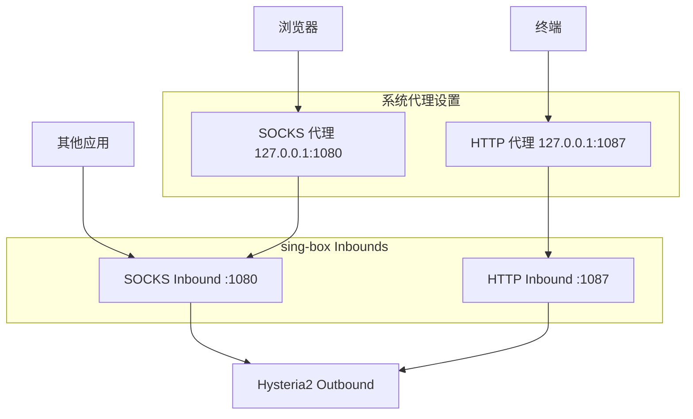
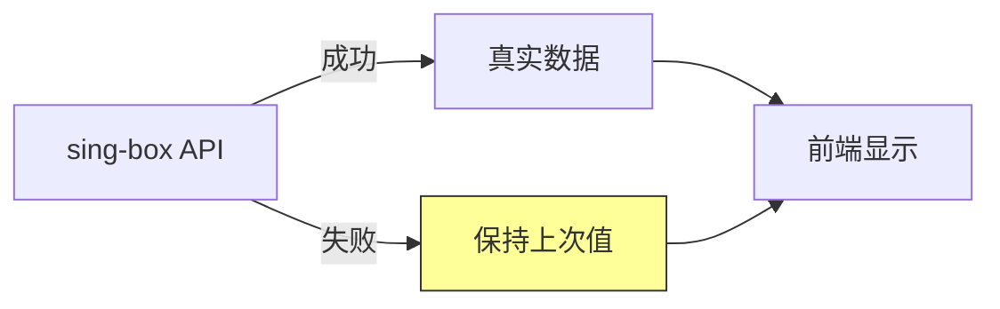

# VPN 增强优化设计文档

## 概述

本设计文档详细描述 ToVPN 项目第二阶段优化的技术实现方案，包括 SOCKS 模式增强、流量/延迟数据真实性保证、服务器列表刷新优化等。

## 架构变更

### 1. SOCKS 模式增强架构



### 2. 流量监控数据流



## 组件设计

### 1. HTTP 代理 Inbound 配置

**文件:** `src-tauri/src/vpn/singbox/socks.rs`

```rust
// 新增 HTTP inbound 配置
let inbounds = json!([
    {
        "type": "socks",
        "tag": "socks-in",
        "listen": "127.0.0.1",
        "listen_port": 1080,
        "sniff": true,
        "sniff_override_destination": true
    },
    {
        "type": "http",
        "tag": "http-in",
        "listen": "127.0.0.1",
        "listen_port": 1087,
        "sniff": true,
        "sniff_override_destination": true
    }
]);
```

### 2. 系统代理设置增强

**文件:** `src-tauri/src/vpn/proxy.rs`

```rust
/// 设置系统 HTTP 代理
pub fn set_system_http_proxy(enable: bool) {
    if !cfg!(target_os = "macos") {
        return;
    }
    
    let service_name = get_active_network_service()
        .unwrap_or_else(|| "Wi-Fi".to_string());
    
    if enable {
        // 设置 HTTP 代理
        let _ = Command::new("networksetup")
            .args(["-setwebproxy", &service_name, "127.0.0.1", "1087"])
            .output();
        let _ = Command::new("networksetup")
            .args(["-setwebproxystate", &service_name, "on"])
            .output();
        
        // 设置 HTTPS 代理
        let _ = Command::new("networksetup")
            .args(["-setsecurewebproxy", &service_name, "127.0.0.1", "1087"])
            .output();
        let _ = Command::new("networksetup")
            .args(["-setsecurewebproxystate", &service_name, "on"])
            .output();
    } else {
        let _ = Command::new("networksetup")
            .args(["-setwebproxystate", &service_name, "off"])
            .output();
        let _ = Command::new("networksetup")
            .args(["-setsecurewebproxystate", &service_name, "off"])
            .output();
    }
}

/// 设置所有系统代理（SOCKS + HTTP）
pub fn set_system_proxy(enable: bool) {
    set_system_socks_proxy(enable);
    set_system_http_proxy(enable);
}
```

### 3. 流量监控真实性保证

**文件:** `src-tauri/src/vpn/monitor.rs`

```rust
// 移除模拟数据生成函数
// fn generate_simulated_traffic() - 删除
// fn generate_simulated_latency() - 删除

// 修改主循环逻辑
let (current_download, current_upload) = match fetch_traffic_from_api(&client, port) {
    Some((down, up)) => {
        api_available = true;
        (down, up)
    }
    None => {
        if api_available {
            warn!("sing-box API unavailable, keeping last values");
            api_available = false;
        }
        // 保持上次的值，速度将显示为 0
        (last_download, last_upload)
    }
};

// 延迟测量
fn measure_real_latency(port: u16) -> i32 {
    // 尝试真实测量
    if let Some(latency) = try_measure_via_proxy() {
        return latency as i32;
    }
    if let Some(latency) = try_measure_via_api(port) {
        return latency as i32;
    }
    // 失败时返回 -1 表示无法测量
    -1
}
```

### 4. 前端显示优化

**文件:** `src/stores/vpn.ts` 和相关组件

```typescript
// 延迟显示逻辑
const latencyDisplay = computed(() => {
  if (stats.value.latency < 0 || stats.value.latency >= 9999) {
    return '--';
  }
  return `${stats.value.latency}ms`;
});

// 速度显示逻辑
const speedDisplay = computed(() => {
  if (stats.value.downloadSpeed === 0 && stats.value.uploadSpeed === 0) {
    // 可能是 API 不可用
    return { down: '--', up: '--' };
  }
  return {
    down: formatSpeed(stats.value.downloadSpeed),
    up: formatSpeed(stats.value.uploadSpeed)
  };
});
```

### 5. 服务器列表刷新优化

**文件:** `src/stores/servers.ts`

```typescript
// 减少缓存时间
const CACHE_TTL_SERVERS = 60 * 1000; // 1 分钟

// 强制刷新方法
async function forceRefreshServers() {
  cache.delete(CACHE_KEYS.SERVERS);
  await loadServers(true);
}

// 智能延迟测试
async function testAllPings() {
  const vpnStore = useVpnStore();
  
  if (vpnStore.isConnected) {
    // VPN 已连接：通过代理测试真实延迟
    await testPingsViaProxy();
  } else {
    // VPN 未连接：直接 TCP 测试
    await testPingsDirect();
  }
}
```

### 6. 带宽限制优化

**文件:** `src-tauri/src/vpn/config.rs`

```rust
impl Default for ConfigOptions {
    fn default() -> Self {
        Self {
            tcp_fast_open: true,
            up_mbps: 500,    // 从 200 提升到 500
            down_mbps: 1000, // 从 500 提升到 1000
            block_quic: true,
        }
    }
}
```

## 数据模型

### 流量统计状态

```typescript
interface TrafficStats {
  downloadBytes: number;      // 总下载字节
  uploadBytes: number;        // 总上传字节
  downloadSpeed: number;      // 下载速度 (bytes/s)，0 表示无数据
  uploadSpeed: number;        // 上传速度 (bytes/s)，0 表示无数据
  isApiAvailable: boolean;    // API 是否可用
}

interface LatencyStats {
  latency: number;            // 延迟 (ms)，-1 表示无法测量
  isRealMeasurement: boolean; // 是否为真实测量值
}
```

## 正确性属性

### Property 1: HTTP 代理配置生成
*For any* SOCKS 模式配置，inbounds 应同时包含 SOCKS (1080) 和 HTTP (1087) 两个入站
**Validates: Requirements 1.1**

### Property 2: 流量数据真实性
*For any* 流量监控周期，当 API 不可用时，流量值应保持不变（速度为 0），不应生成随机数据
**Validates: Requirements 2.2, 2.3**

### Property 3: 延迟数据真实性
*For any* 延迟测量失败的情况，返回值应为 -1 或 9999，不应生成随机延迟值
**Validates: Requirements 3.2, 3.3**

### Property 4: 服务器列表缓存
*For any* 强制刷新操作，应清除缓存并从 API 获取最新数据
**Validates: Requirements 4.1**

### Property 5: 系统代理设置完整性
*For any* SOCKS 模式启用/禁用操作，应同时设置/清除 SOCKS 和 HTTP 代理
**Validates: Requirements 1.2, 1.4**

## 错误处理

| 错误场景 | 处理策略 |
|---------|---------|
| sing-box API 不可用 | 保持上次流量值，速度显示 0 |
| 延迟测试超时 | 返回 -1，前端显示 "--" |
| 服务器列表 API 失败 | 使用缓存数据，显示错误提示 |
| 系统代理设置失败 | 记录日志，继续运行 |

## 测试策略

### 单元测试
- HTTP 代理配置生成测试
- 流量数据处理逻辑测试
- 延迟测量逻辑测试
- 缓存刷新逻辑测试

### 属性基测试
- 使用 fast-check 验证数据真实性属性
- 验证配置生成的完整性

### 集成测试
- 系统代理设置端到端测试
- 流量监控端到端测试
