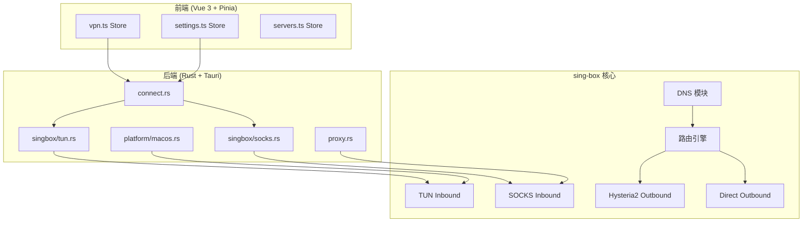
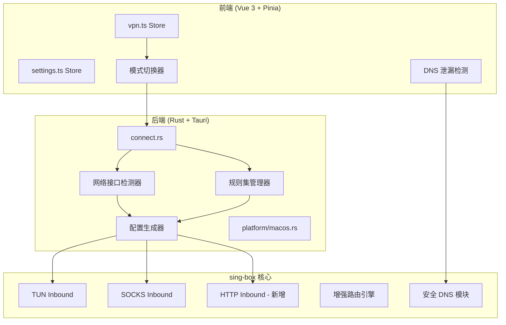
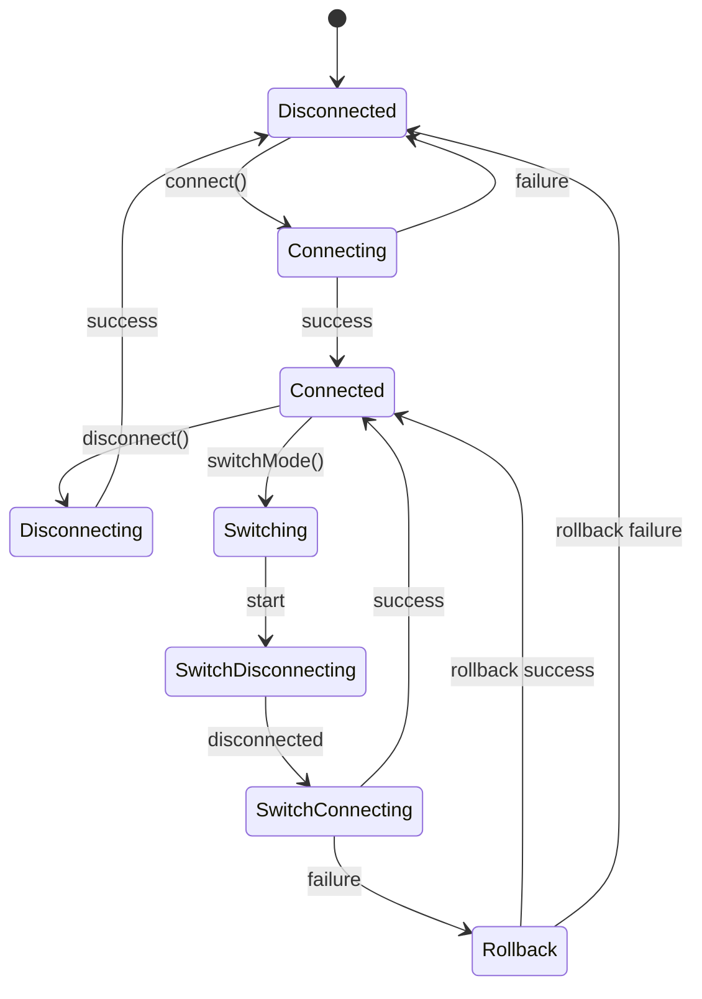

# VPN 模式优化设计文档

## 配置参数分析

### 当前设置项状态

| 设置项 | 前端 UI | 后端使用 | 状态 |
|--------|---------|----------|------|
| `connectionMode` | ✅ 有 | ✅ 生效 | 正常 |
| `mtu` | ✅ 有 | ✅ 生效 | 正常 |
| `dnsMode` | ✅ 有 | ✅ 生效 | 正常 |
| `customDns` | ✅ 有 | ✅ 生效 | 正常 |
| `autoReconnect` | ✅ 有 | ✅ 生效 | 正常 |
| `killSwitch` | ❌ 无 UI | ❌ 未实现 | **未生效** |
| `tcp_fast_open` | ❌ 无 UI | ⚠️ 仅 TUN 模式 | **SOCKS 缺失** |

### 发现的问题

#### 1. `killSwitch` 未实现
- 类型定义存在 (`src/types/vpn.ts`)
- 默认值设置 (`src/stores/settings.ts`)
- **但没有任何实际实现代码**
- **没有 UI 控件**

#### 2. `tcp_fast_open` 仅 TUN 模式启用
- TUN 模式 (`tun.rs:111`): ✅ `"tcp_fast_open": true`
- SOCKS 模式 (`socks.rs:85-98`): ❌ **缺失**

#### 3. 缺少高级配置选项
以下参数硬编码在后端，用户无法配置：
- `up_mbps: 200` / `down_mbps: 500` - 带宽限制
- QUIC 阻断 (`port: 443, network: udp, action: reject`)
- DNS 缓存策略 (`independent_cache: true`)

### 建议新增的 UI 设置项

#### 高优先级 (P0)

| 设置项 | 类型 | 默认值 | 说明 |
|--------|------|--------|------|
| `enableTcpFastOpen` | boolean | true | TCP Fast Open 开关 |

#### 中优先级 (P1)

| 设置项 | 类型 | 默认值 | 说明 |
|--------|------|--------|------|
| `upMbps` | number | 200 | 上行带宽限制 (Mbps) |
| `downMbps` | number | 500 | 下行带宽限制 (Mbps) |
| `blockQuic` | boolean | true | 阻断 QUIC 流量 |

#### 低优先级 (P2)

| 设置项 | 类型 | 默认值 | 说明 |
|--------|------|--------|------|
| `killSwitch` | boolean | false | 断网保护（需实现） |
| `enableHttpProxy` | boolean | false | 启用 HTTP 代理端口 |
| `httpProxyPort` | number | 1087 | HTTP 代理端口 |
| `extraDirectDomains` | string[] | [] | 额外直连域名 |

### 需要修复的代码

#### 1. SOCKS 模式添加 tcp_fast_open

```rust
// src-tauri/src/vpn/singbox/socks.rs
let proxy_ob = json!({
    "type": "hysteria2",
    "tag": "proxy",
    "server": hysteria_server,
    "server_port": config.server_port,
    "password": config.password,
    "up_mbps": 200,
    "down_mbps": 500,
    "tcp_fast_open": true,  // 新增
    "tls": {
        "enabled": true,
        "alpn": ["h3"],
        "insecure": true,
        "server_name": &config.server_host
    }
});
```

#### 2. 移除或实现 killSwitch

选项 A: 移除未实现的字段
```typescript
// src/types/vpn.ts
export interface VpnSettings {
  mtu: number;
  dnsMode: DnsMode;
  customDns: string;
  autoReconnect: boolean;
  // killSwitch: boolean;  // 移除
  connectionMode: ConnectionMode;
}
```

选项 B: 实现 killSwitch 功能
- 需要在 TUN 模式下配置防火墙规则
- 断开 VPN 时阻断所有非本地流量
- 复杂度较高，建议 P2 优先级

## 概述

本设计文档详细描述 ToVPN 项目的 SOCKS/TUN 模式优化方案，重点解决网络接口检测、节点纯净度保护、平滑模式切换和 DNS 安全增强等问题。

## 架构

### 当前架构



### 优化后架构



## 组件和接口

### 1. 网络接口检测器 (InterfaceDetector)

**位置:** `src-tauri/src/vpn/platform/interface.rs` (新增)

```rust
/// 网络接口检测结果
pub struct InterfaceInfo {
    pub name: String,           // 接口名称 (en0, en1, etc.)
    pub interface_type: String, // wifi, ethernet, other
    pub is_active: bool,        // 是否活跃
    pub ipv4_address: Option<String>,
    pub ipv6_address: Option<String>,
}

/// 检测当前活动的网络接口
pub fn detect_active_interface() -> Option<InterfaceInfo>;

/// 获取所有可用网络接口
pub fn list_all_interfaces() -> Vec<InterfaceInfo>;

/// 验证接口是否可用
pub fn validate_interface(name: &str) -> bool;
```

### 2. 规则集管理器 (RulesetManager)

**位置:** `src-tauri/src/vpn/ruleset.rs` (新增)

```rust
/// 规则集信息
pub struct RulesetInfo {
    pub name: String,           // geosite-cn, geoip-cn
    pub path: PathBuf,          // 本地路径
    pub version: String,        // 版本号
    pub last_updated: DateTime, // 最后更新时间
    pub is_valid: bool,         // 是否有效
}

/// 检查规则集状态
pub fn check_ruleset_status() -> Vec<RulesetInfo>;

/// 下载/更新规则集
pub async fn update_ruleset(name: &str) -> Result<RulesetInfo>;

/// 验证规则集完整性
pub fn validate_ruleset(path: &Path) -> bool;

/// 检查是否需要更新 (超过 7 天)
pub fn needs_update(info: &RulesetInfo) -> bool;
```

### 3. 模式切换器 (ModeSwitcher)

**位置:** `src/stores/vpn/useModeSwitcher.ts` (新增)

```typescript
interface ModeSwitchState {
  isSwitching: boolean;
  previousMode: ConnectionMode | null;
  targetMode: ConnectionMode | null;
  progress: 'saving' | 'disconnecting' | 'switching' | 'connecting' | 'done' | 'failed';
  error: string | null;
}

interface ModeSwitcher {
  state: Ref<ModeSwitchState>;
  
  // 切换模式 (自动处理断开-重连)
  switchMode(targetMode: ConnectionMode): Promise<boolean>;
  
  // 取消切换
  cancelSwitch(): void;
  
  // 回退到原模式
  rollback(): Promise<boolean>;
}
```

### 4. DNS 泄漏检测器 (DNSLeakTest)

**位置:** `src-tauri/src/vpn/dns_leak_test.rs` (已存在，需增强)

```rust
/// DNS 泄漏检测结果
pub struct DNSLeakResult {
    pub is_leaking: bool,
    pub local_dns_detected: Vec<String>,   // 检测到的本地 DNS
    pub remote_dns_used: Vec<String>,      // 使用的远程 DNS
    pub test_domains: Vec<DNSTestResult>,  // 测试域名结果
}

pub struct DNSTestResult {
    pub domain: String,
    pub resolved_by: String,  // local, remote, unknown
    pub ip_addresses: Vec<String>,
    pub response_time_ms: u64,
}

/// 执行 DNS 泄漏检测
pub async fn test_dns_leak() -> Result<DNSLeakResult>;

/// 检测单个域名的 DNS 解析路径
pub async fn trace_dns_resolution(domain: &str) -> Result<DNSTestResult>;
```

### 5. 增强配置生成器

**位置:** `src-tauri/src/vpn/singbox/mod.rs` (修改)

```rust
/// 配置生成选项
pub struct ConfigOptions {
    pub mode: String,                    // tun, socks
    pub interface_name: Option<String>,  // 动态检测的接口名
    pub enable_http_proxy: bool,         // 是否启用 HTTP 代理
    pub http_proxy_port: u16,            // HTTP 代理端口
    pub enhanced_dns: bool,              // 增强 DNS 安全
    pub extra_direct_domains: Vec<String>, // 额外直连域名
}

/// 生成配置 (增强版)
pub fn generate_config_v2(
    config: &ConnectConfig,
    options: &ConfigOptions,
    cache_path: &Path,
) -> Result<Value>;
```

## 数据模型

### 连接模式状态机



### 配置数据结构

```typescript
// 增强的 VPN 设置
interface EnhancedVpnSettings extends VpnSettings {
  // 现有字段 (已生效)
  mtu: number;
  dnsMode: DnsMode;
  customDns: string;
  autoReconnect: boolean;
  connectionMode: ConnectionMode;
  
  // 移除未实现的字段
  // killSwitch: boolean;  // 暂不实现
  
  // 新增字段 - 高优先级
  enableTcpFastOpen: boolean;    // TCP Fast Open (默认 true)
  
  // 新增字段 - 中优先级
  upMbps: number;                // 上行带宽限制 (默认 200)
  downMbps: number;              // 下行带宽限制 (默认 500)
  blockQuic: boolean;            // 阻断 QUIC (默认 true)
  
  // 新增字段 - 低优先级
  enableHttpProxy: boolean;      // 启用 HTTP 代理
  httpProxyPort: number;         // HTTP 代理端口 (默认 1087)
  enhancedDnsSecurity: boolean;  // 增强 DNS 安全
  autoUpdateRuleset: boolean;    // 自动更新规则集
  extraDirectDomains: string[];  // 额外直连域名列表
  
  // IPv6 和延迟优化
  disableIpv6: boolean;          // 禁用 IPv6 (默认 true)
  latencyTestInterval: number;   // 延迟测试间隔 (秒)
  autoSelectServer: boolean;     // 自动选择最优服务器
}

// 延迟监控指标
interface LatencyMetrics {
  current: number;      // 当前延迟 (ms)
  min: number;          // 最小延迟
  max: number;          // 最大延迟
  avg: number;          // 平均延迟
  jitter: number;       // 抖动 (延迟标准差)
  samples: number[];    // 最近 30 个样本
  lastUpdated: number;  // 最后更新时间戳
}

// 规则集状态
interface RulesetStatus {
  geositeCn: {
    exists: boolean;
    lastUpdated: string | null;
    needsUpdate: boolean;
  };
  geoipCn: {
    exists: boolean;
    lastUpdated: string | null;
    needsUpdate: boolean;
  };
}
```

## 正确性属性

*A property is a characteristic or behavior that should hold true across all valid executions of a system-essentially, a formal statement about what the system should do. Properties serve as the bridge between human-readable specifications and machine-verifiable correctness guarantees.*

### Property 1: 网络接口检测正确性
*For any* 系统网络状态，如果存在活动的网络接口，则 `detect_active_interface()` 应返回有效的接口信息
**Validates: Requirements 1.1, 1.2**

### Property 2: 接口检测回退逻辑
*For any* 网络接口检测失败的情况，生成的 TUN 配置应不包含 `bind_interface` 字段，而是依赖 `auto_detect_interface: true`
**Validates: Requirements 1.3, 6.3**

### Property 3: TUN 配置接口绑定
*For any* 成功检测到的网络接口，生成的 TUN 配置中 direct outbound 的 `bind_interface` 应等于检测到的接口名
**Validates: Requirements 6.1, 6.2**

### Property 4: 路由规则完整性
*For any* 生成的路由配置，应包含以下直连规则（按优先级）：VPN 服务器 IP、私有 IP、.cn 域名、geosite-cn、geoip-cn
**Validates: Requirements 5.1, 5.2, 7.1**

### Property 5: DNS 规则正确性
*For any* TUN 模式配置，DNS 规则应确保：geosite-cn 域名使用本地 DNS，其他域名使用远程 DoH DNS
**Validates: Requirements 4.1, 4.2**

### Property 6: 模式切换状态机正确性
*For any* 已连接状态下的模式切换请求，状态应依次经过：connected → switching → (disconnecting → connecting) → connected
**Validates: Requirements 3.1, 3.2, 8.1, 8.2**

### Property 7: 模式切换回退逻辑
*For any* 模式切换失败的情况，系统应尝试恢复到原模式，最终状态应为 connected（原模式）或 disconnected
**Validates: Requirements 3.3, 8.3**

### Property 8: 规则集版本检查
*For any* 规则集文件，如果最后修改时间超过 7 天，`needs_update()` 应返回 true
**Validates: Requirements 5.3, 7.3**

### Property 9: 流量统计完整性
*For any* VPN 连接会话，断开时上报的统计数据应包含：node_id、traffic_download、traffic_upload、duration、connected_at、disconnected_at
**Validates: Requirements 9.1, 9.3**

### Property 10: HTTP 代理配置生成
*For any* 启用 HTTP 代理的 SOCKS 模式配置，inbounds 应同时包含 SOCKS 和 HTTP 类型的入站
**Validates: Requirements 2.3**

### Property 11: IPv4 Only 策略
*For any* 生成的配置，DNS 策略应为 `ipv4_only`，TUN 网卡地址应仅包含 IPv4 CIDR
**Validates: Requirements - IPv6 禁用**

### Property 12: 延迟监控数据完整性
*For any* 延迟监控会话，记录的指标应包含：current、min、max、avg、jitter
**Validates: Requirements - 延迟优化**

### Property 13: TCP Fast Open 配置
*For any* Hysteria2 outbound 配置，应包含 `tcp_fast_open: true` 以减少连接延迟
**Validates: Requirements - 延迟优化**

## 错误处理

### 网络接口检测错误

| 错误场景 | 处理策略 |
|---------|---------|
| 无活动网络接口 | 返回 None，配置生成时使用 auto_detect_interface |
| 接口名称无效 | 记录警告日志，回退到自动检测 |
| 权限不足 | 返回错误，提示用户检查系统权限 |

### 规则集错误

| 错误场景 | 处理策略 |
|---------|---------|
| 规则集文件不存在 | 自动下载最新版本 |
| 规则集文件损坏 | 删除并重新下载 |
| 下载失败 | 使用缓存版本（如有），否则报错 |
| 版本过旧 | 显示更新提示，允许继续使用 |

### 模式切换错误

| 错误场景 | 处理策略 |
|---------|---------|
| 断开原连接失败 | 强制清理，继续切换流程 |
| 新模式连接失败 | 尝试回退到原模式 |
| 回退也失败 | 设置状态为 disconnected，显示错误 |
| 切换超时 | 取消切换，尝试回退 |

### DNS 泄漏检测错误

| 错误场景 | 处理策略 |
|---------|---------|
| 测试服务器不可达 | 返回 "无法检测" 状态 |
| 检测超时 | 返回部分结果，标记为不完整 |
| VPN 未连接 | 返回错误，提示先连接 VPN |

## 测试策略

### 双重测试方法

本设计采用单元测试和属性基测试相结合的方法：

- **单元测试**: 验证具体示例和边界情况
- **属性基测试**: 验证跨所有输入的通用属性

### 属性基测试框架

- **前端**: 使用 `fast-check` v4.4.0
- **后端**: 使用 `proptest` crate
- 每个属性测试运行最少 100 次迭代

### 测试文件结构

```
src/__tests__/
├── stores/
│   ├── mode-switcher.property.test.ts  # Property 6, 7
│   └── settings-enhanced.property.test.ts
├── utils/
│   └── ruleset-check.property.test.ts  # Property 8
└── integration/
    └── config-generation.test.ts       # Property 1-5, 10

src-tauri/src/vpn/
├── platform/
│   └── interface_test.rs               # Property 1, 2, 3 (Rust)
├── singbox/
│   └── config_test.rs                  # Property 4, 5, 10 (Rust)
└── ruleset_test.rs                     # Property 8 (Rust)
```

### 测试标注格式

每个属性基测试必须包含以下注释：

```typescript
/**
 * **Feature: vpn-optimization, Property 1: 网络接口检测正确性**
 * **Validates: Requirements 1.1, 1.2**
 */
```

### 关键测试场景

1. **网络接口检测**
   - Wi-Fi 活跃时返回 en0
   - 以太网活跃时返回 en1/en2
   - 无网络时返回 None
   - 多接口时选择活跃的

2. **配置生成**
   - TUN 模式包含正确的 bind_interface
   - SOCKS 模式不包含 bind_interface
   - 路由规则按正确顺序排列
   - DNS 规则正确分流

3. **模式切换**
   - 正常切换流程
   - 切换失败回退
   - 并发切换请求处理
   - 切换过程中断开请求

4. **规则集管理**
   - 文件存在性检查
   - 版本过期检查
   - 下载和更新流程
   - 完整性验证

## IPv6 和延迟优化

### IPv6 禁用策略

由于 VPS 服务器不支持 IPv6，需要确保所有流量走 IPv4：

```rust
// DNS 策略配置
"strategy": "ipv4_only"  // 强制只解析 IPv4 地址

// TUN 网卡配置 - 移除 IPv6 地址
"address": ["172.19.0.1/30"]  // 仅 IPv4，移除 fdfe::1/126
```

**配置变更:**

1. **DNS 解析策略**: 保持 `ipv4_only`，不解析 AAAA 记录
2. **TUN 网卡地址**: 仅配置 IPv4 CIDR，移除 IPv6 CIDR
3. **路由规则**: 不添加 IPv6 相关规则

### 网络延迟优化

#### 1. TCP Fast Open (TFO)

```rust
// Hysteria2 outbound 配置
"tcp_fast_open": true  // 减少 TCP 握手延迟
```

#### 2. 连接复用

```rust
// 启用连接多路复用
"up_mbps": 200,
"down_mbps": 500,
// Hysteria2 自带 QUIC 多路复用
```

#### 3. DNS 缓存优化

```rust
"dns": {
    "independent_cache": true,  // 独立 DNS 缓存
    "cache_capacity": 1000,     // 缓存容量
    // 新增: 预取热门域名
}
```

#### 4. 智能服务器选择

```typescript
// 前端延迟测试优化
interface ServerLatencyInfo {
  serverId: number;
  latency: number;        // 当前延迟
  avgLatency: number;     // 平均延迟
  packetLoss: number;     // 丢包率
  lastTested: number;     // 最后测试时间
}

// 自动选择最优服务器
function selectOptimalServer(servers: ServerLatencyInfo[]): number {
  // 综合考虑延迟和丢包率
  return servers
    .filter(s => s.packetLoss < 0.1)  // 丢包率 < 10%
    .sort((a, b) => a.avgLatency - b.avgLatency)[0]?.serverId;
}
```

#### 5. QUIC 优化

```rust
// 禁用 UDP 443 (QUIC) 以避免与 Hysteria2 冲突
{ "port": 443, "network": "udp", "action": "reject" }
```

### 延迟监控增强

```typescript
// 新增延迟监控指标
interface LatencyMetrics {
  current: number;      // 当前延迟
  min: number;          // 最小延迟
  max: number;          // 最大延迟
  avg: number;          // 平均延迟
  jitter: number;       // 抖动
  samples: number[];    // 最近 N 个样本
}

// 延迟异常检测
function detectLatencyAnomaly(metrics: LatencyMetrics): boolean {
  // 当前延迟超过平均值 3 倍视为异常
  return metrics.current > metrics.avg * 3;
}
```

## 实现注意事项

### 向后兼容性

- 新增字段使用可选类型，默认值保持现有行为
- 配置迁移逻辑处理旧版本设置
- API 变更保持向后兼容

### 性能考虑

- 网络接口检测结果缓存 30 秒
- 规则集版本检查每次启动时执行一次
- 模式切换使用乐观 UI 更新

### 安全考虑

- 规则集下载使用 HTTPS
- 规则集文件签名验证
- DNS 泄漏检测不发送敏感信息
